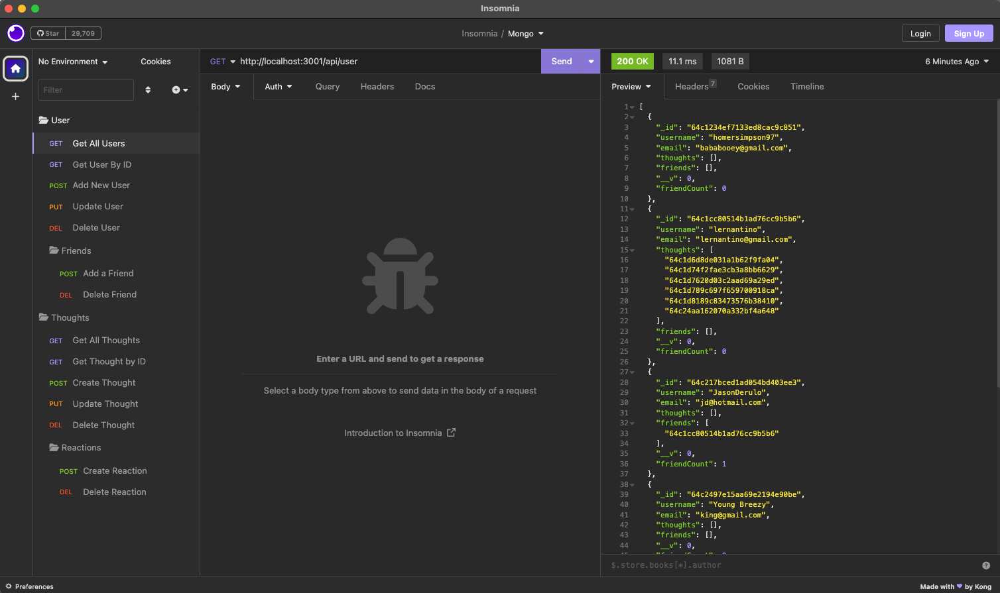

# Social Network API

## Project Link

https://github.com/mlukicdesign/Social-Network-API/tree/main

### Walkthrough Video
https://drive.google.com/file/d/1gZjmRzYvXbCIFGPIBISQfNcMNyUyY42l/view

### Project Mockup

## Setup

To set up and run the Social Network API project on your local machine, follow these steps:

1. Clone the repository from GitHub:

    git clone https://github.com/mlukicdesign/social-network-api.git

2.Navigate to the project directory:

    cd social-network-api

3. Install the required dependencies:

    npm init
    npm install

    Configure the MongoDB database:

    Ensure you have MongoDB installed and running on your system.
    Update the MongoDB connection string in the config.js file to point to your local database or a cloud-hosted database.

5.Start the server:

    npm start
    The API server will now be running locally on http://localhost:3001

## Usage

The Social Network API provides endpoints to handle user data, thoughts, and friend lists. Here are the main API routes:

#### User Routes:

- POST /api/users: Create a new user.
- GET /api/users: Get a list of all users.
- GET /api/users/:userId: Get details of a specific user.
- PUT /api/users/:userId: Update user information.
- DELETE /api/users/:userId: Delete a user.
Thought Routes:

- POST /api/thoughts: Create a new thought for a user.
- GET /api/thoughts: Get all thoughts.
- GET /api/thoughts/:thoughtId: Get details of a specific thought.
- PUT /api/thoughts/:thoughtId: Update a thought.
- DELETE /api/thoughts/:thoughtId: Delete a thought.
Reaction Routes:

- POST /api/thoughts/:thoughtId/reactions: Add a reaction to a thought.
- DELETE /api/thoughts/:thoughtId/reactions/:reactionId: Remove a reaction from a thought.

#### Friend Routes:

- POST /api/users/:userId/friends/:friendId: Add a user to the friend list.
- DELETE /api/users/:userId/friends/:friendId: Remove a user from the friend list.

### Get Users
To retrieve a list of all users, make a GET request to /api/users. The API will respond with a JSON array containing user objects. Each user object will have the following properties:

- _id: The unique identifier of the user.
- username: The username of the user.
- email: The email address of the user.
- thoughts: An array of thought objects representing the user's thoughts.
- friends: An array of user objects representing the user's friends.

### Get Thoughts
To fetch all thoughts, send a GET request to /api/thoughts. The API will return a JSON array containing thought objects. Each thought object will have the following properties:

- _id: The unique identifier of the thought.
- thoughtText: The text content of the thought.
- createdAt: The timestamp of when the thought was created.
- username: The username of the user who posted the thought.
- reactions: An array of reaction objects representing users' reactions to the thought.

## Conclusion

This API allows users to share their thoughts, react to friends' thoughts, and maintain a friend list. It utilizes MongoDB as its database, Express.js for routing, and Mongoose ODM for data modeling.

## CONTACT ME

For any questions, feedback, or inquiries, feel free to reach out:

Email: mlukicdesign@gmail.com
GitHub: https://github.com/mlukicdesign

 

